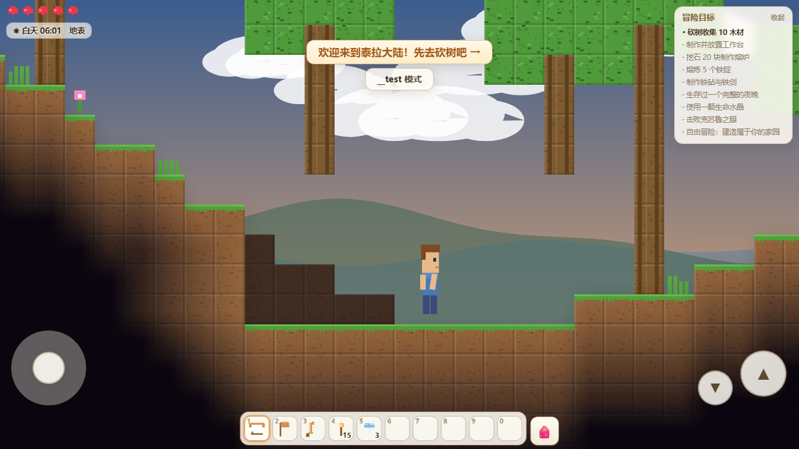

# 泰拉物语（Taila Wuyu）

一个致敬《泰拉瑞亚》的纯前端 2D 沙盒冒险游戏：**挖掘 · 建造 · 合成 · 昼夜生存 · Boss 战**。

**在线游玩：https://yjj0339.github.io/taila-wuyu/** （手机浏览器直接可玩，支持触屏摇杆）



## 玩法

- 🌍 **程序化大世界**：1200×400 方块，雪原 / 森林 / 沙漠三大生态，洞穴、矿脉、地狱岩浆层
- ⛏ **挖掘与建造**：木头→石头→铜铁银金→宝石→狱岩，工具等级逐级解锁；方块/平台/门/火把自由建造
- 🧪 **合成链**：徒手 → 工作台 → 熔炉 → 铁砧，27 种配方还原泰拉瑞亚进度
- 🌙 **昼夜生存**：白天史莱姆，夜晚僵尸与恶魔之眼；火把照亮黑暗，庇护所保命
- 👁 **Boss 战**：合成「可疑眼球」召唤**克苏鲁之眼**（半血狂暴两阶段）；「史莱姆王冠」召唤**史莱姆王**
- ❤ **成长**：地下寻找生命水晶，生命上限 100 → 400
- 💾 自动存档（浏览器本地），随时继续冒险

## 操作

| 电脑 | 手机 |
|---|---|
| A/D 移动 · 空格跳 · S 下穿平台 | 左侧摇杆移动（上推跳跃）· ▲ 跳 · ▼ 下穿 |
| 鼠标左键 挖掘/攻击/放置/开关门 | 点击/按住屏幕 挖掘/攻击/放置 |
| 1-0 或滚轮切换物品 · E 背包 · Esc 暂停 | 点热键栏切换 · 点 🎒 背包 |

## 冒险目标（新手引导）

砍树收集木材 → 制作工作台 → 熔炉 → 炼铁 → 铁砧打造铁剑 → 生存过一个夜晚 → 使用生命水晶 → **击败克苏鲁之眼** → 自由建造你的家园！

## 技术

零依赖、零外部资源：原生 Canvas 2D 渲染 + WebAudio 合成音效，全部贴图为程序化生成像素画。
BFS 光照传播引擎、tile 碰撞物理（自动上台阶/单向平台）、RLE 压缩本地存档。

## 本地运行

```
node tools/server.js 8124
# 打开 http://localhost:8124/
```

测试钩子：`?__test&time=night&give=iron_pick,iron_sword&pos=600,90`

## 开发

见 [DEVLOG.md](DEVLOG.md)（架构、踩坑、测试基建）。测试：`node tools/smoke.mjs`（需本地服务器在 8124）。
